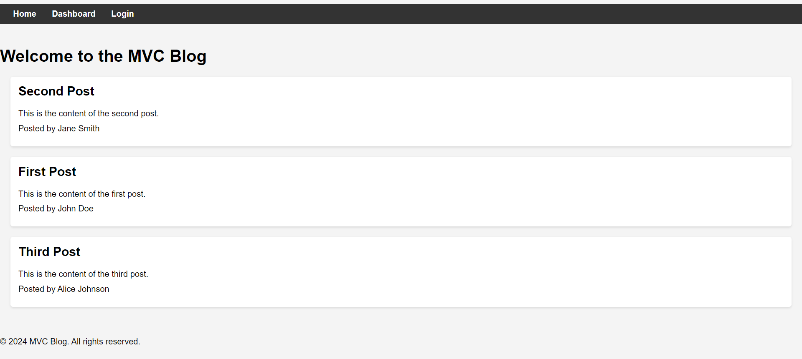
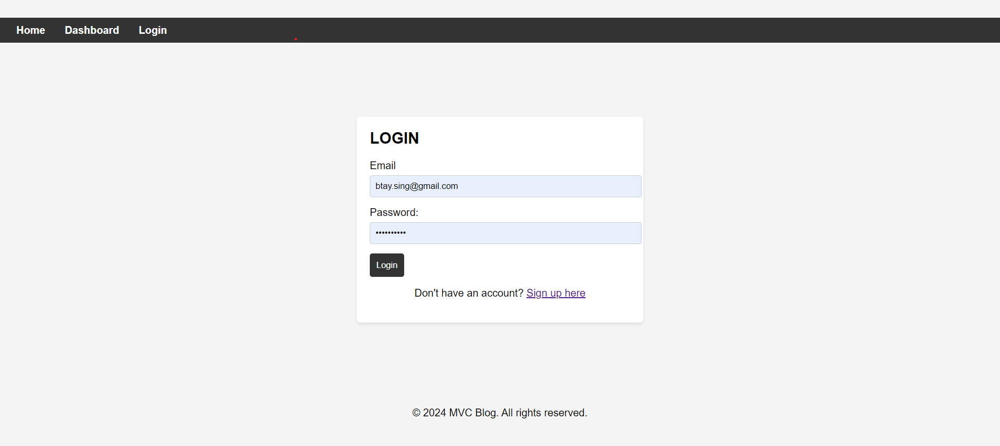

# MVC-Blogspace

## Description
Welcome to the MVC Blog! A space where users can share their posts and comment on existing posts. Sign up and get blogging now!

## Technologies Used
Javascript, Express, handlebars, Sequelize, dotenv, PostgreSQL, Node modules.

## Installation
1. Clone the repository: git clone https://github.com/yourusername/E-Commerce.git
2. cd into the project
3. run npm run seed
4. node server.js

## Usage
1. Visit the blog at the render link below
2. Create an account by clicking on sign-up
3. View existing posts
4. Create a new post
5. Edit an existing post
6. Comment on an existing post

## Contributing
If you would like to contribute to this project, please fork the repository and submit a pull request with any changes.

## License
This project is not licensed.

## Links
Github: https://github.com/Betzaida96/MVC-Blogspace

Render: 

## Photos

